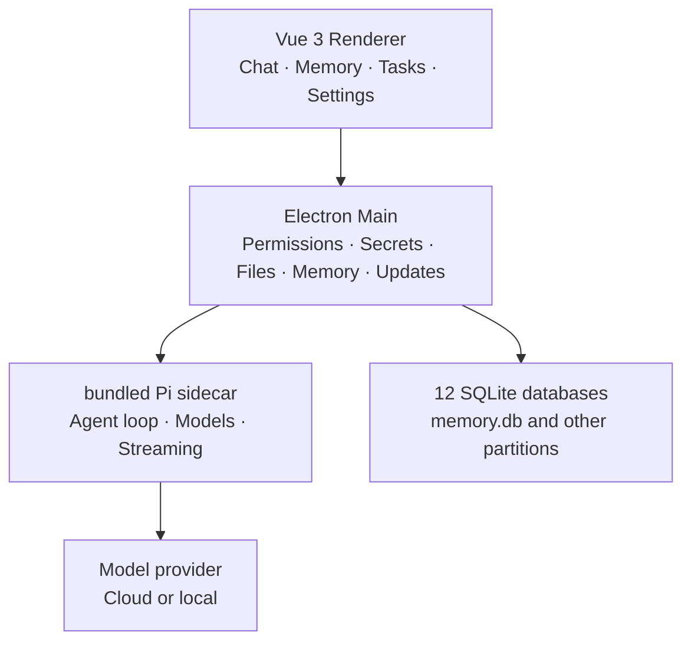

<p align="center">
  <a href="./README.md">简体中文</a> ·
  <a href="./README.en.md"><b>English</b></a>
</p>

<p align="center">
  
</p>

### A local-first AI office assistant with governed long-term memory.

**Bring your own model. Open a folder on this machine. Let the agent work — and always see what it remembered, and which memories were injected this turn.**

Local-first · Governed memory · Model-agnostic · Windows / macOS / Linux

[](https://github.com/onehopeA10/pibuddy/actions/workflows/ci.yml)
[](https://github.com/onehopeA10/pibuddy/stargazers)

**[Run from source](#from-clone-to-first-reply)** ·
[Docs](pibuddy-docs/README.md) ·
[Architecture](pibuddy-docs/docs/en/architecture/index.md) ·
[简体中文](README.md)

**No PiBuddy account. No mandatory relay. Conversations are not written to long-term memory by default.**

Sessions, memories, tasks, and settings stay on your computer. Model requests go to the provider or local endpoint you configure.

> [!IMPORTANT]
> PiBuddy is under active development. The default UI is Chinese. It already covers real chat, tasks, memory, and office workflows; APIs and some desktop behavior will keep evolving.

---

## Not another chat window

Most assistants live in a terminal, an editor extension, or a hosted account.

**PiBuddy gives the office agent a workspace of its own:** chat, tasks, library, memory, channels, workflows, terminal, models, and settings. Developer tools (PTY, Git, worktrees) stay in advanced mode.

Pi runs the agent loop. PiBuddy makes it durable on a desktop — especially **remembering the right things across sessions, on your terms.**

### Memory you can govern

This is the sharpest difference from a typical coding-agent desktop.

Long-term memory is not “chat history saved twice.” It is a governed store:

| You can | The contract |
| --- | --- |
| **Save on purpose** | Facts, preferences, instructions, context — workspace or global |
| **See injections** | Relevant turns get references; the panel lists what was stuffed into the model this turn |
| **Confirm extracts** | Candidates pulled from a session start excluded until you accept them |
| **Edit, merge, delete** | View, edit, merge, exclude, delete, export. Deleted rows cannot be retrieved or injected again |
| **Knowledge base** | Documents and snippets with provenance |
| **Semantic search** | Local hash embeddings work without a key; optional provider embeddings if you configure one |
| **Secrets stay out** | Likely API keys are rejected; sensitive paths are stored but not injected by default |

Memories live in local `memory.db`. Disabling the capability tears down handles only — **rows are not deleted**. Uninstall and wipe are different actions.

Conversations are not auto-promoted into long-term memory. If the model “knew” something you said last week, you can find it, fix it, or delete it on the Memory page.

### Your models

OpenAI, Anthropic, OpenAI-compatible APIs, and local gateways. Switch model, thinking level, and approval mode in the composer without recreating the session.

### Your files stay here

Open a local workspace. Session JSONL, twelve capability-partitioned SQLite databases, and secrets (OS secure storage) never require a PiBuddy cloud. No telemetry.

### The agent works under permission

File reads, edits, and commands go through the permission layer. The composer can ask every time, accept edits, ask less, or stand down. Plan mode writes a plan before it acts.

---

## One desktop, real office work

| | **Chat** | **Memory** | **Tasks / workflows** |
| --- | --- | --- | --- |
| **You approve** | Whether it should act this turn | Which facts may persist | When it runs and how far |
| **The agent does** | Read, edit, produce artifacts | Inject confirmed memories into relevant turns | Run on a schedule or a graph; sessions can stay in the background |
| **Best for** | Write, look up, edit, summarize | Recognition across days and sessions | Recurring work and long jobs |

You can queue a follow-up while a turn is streaming. After a long idle stretch the foreground runtime sleeps; focusing the window or sending a message wakes it. You should not need to restart the app just because it stayed open.

---

## Local-first, precisely

Local-first is not “nothing ever touches the network.”

| Data | Behavior |
| --- | --- |
| Conversations | Local JSONL with a SQLite index |
| Long-term memory / knowledge | Local `memory.db` (FTS + vectors). Delete clears body, index, and injection cache |
| Tasks, workflows, artifacts, usage… | Other capability databases, also local and backup-able |
| Settings | On this machine |
| API credentials | OS secure storage / main-process vault; UI sees “configured / last four” |
| Logs | Local, redacted |
| PiBuddy telemetry | None |
| Model requests | Directly to the provider or endpoint you configure |

There is no required PiBuddy account and no mandatory relay. If you use a remote model, the context for that request leaves the machine under that provider’s privacy policy.

---

## From clone to first reply

1. **Requirements:** Node.js `>=22`, pnpm `>=10`.
2. **Start**

```bash
git clone https://github.com/onehopeA10/pibuddy.git
cd pibuddy
pnpm install
pnpm dev
```

3. **Connect a model** in **Models** or Settings. Choose an official provider or a compatible API. Credentials stay in the local vault.
4. **Open a workspace** and talk. Persist facts on the **Memory** page, or extract from a session and confirm row by row.
5. **Inspect hits** on the next relevant turn. Fix or delete anything that should not have been injected.

Before a release:

```bash
pnpm typecheck
pnpm test
pnpm test:regression
```

Packaging: [docs/product/RELEASE_SETUP.md](docs/product/RELEASE_SETUP.md).

---

## Architecture

The UI, privileged desktop capabilities, and the agent loop are separate. The renderer has no Node integration.



| Layer | Responsibility |
| --- | --- |
| Renderer | Presentation only; state is normalized per session |
| Preload | A narrow, revocable, validated bridge under `contextIsolation` |
| Main | Process supervision, permissions, secrets, files, Git, terminal, memory injection, backup |
| pi sidecar | JSONL over stdio; bundled Pi by default, swappable |
| SQLite | Partitioned by capability; consistent and backup-able per database; no cross-db foreign keys |

**[Architecture notes →](pibuddy-docs/docs/en/architecture/index.md)**

---

## Built on pi

PiBuddy builds on the [pi-mono](https://github.com/badlogic/pi-mono) agent runtime.

> **Pi runs the agent. PiBuddy makes it a durable office desktop — remember on purpose, delete for real.**

Stack: Electron, Vue 3, Pinia, Naive UI, TypeScript, electron-vite, node:sqlite.

---

## Status

Default UI is for non-developers: chat, files and artifacts, history, tasks, memory, settings.

Shipped so far includes bundled Pi and a runtime supervisor, multi-provider models, permissions and approval modes, sessions and drafts, governed long-term memory (explicit save / extract-and-confirm / injection hits / knowledge base / semantic search), scheduled tasks, workflows, connectors, terminal, usage, local backup/restore, and idle sleep / focus wake.

Primary platform is Windows 11 x64; macOS and Ubuntu are secondary. Remote features are off by default. No telemetry.

---

## Docs

The VitePress site lives in [`pibuddy-docs/`](pibuddy-docs/README.md) (Chinese default, English at `/en/`):

```bash
cd pibuddy-docs
pnpm install
pnpm dev
```

- [Product scope and milestones](pibuddy-docs/docs/en/guide/product-scope.md)
- [Architecture](pibuddy-docs/docs/en/architecture/index.md)
- [Security](pibuddy-docs/docs/en/security/index.md)
- [Data and backup](pibuddy-docs/docs/en/data/index.md)
- [Release](docs/product/RELEASE_SETUP.md)

Chinese README: [README.md](README.md).

---

## Contributing

Issues, bug reports, product proposals, docs, and code are welcome. For larger changes, open an issue first so the boundary is clear — especially memory: conversations are not auto-written to the long-term store, and deletes must also clear injection.

---

### Remember on purpose. Delete for real. The model is a part, not the product.

**[Clone and run](#from-clone-to-first-reply)** · [简体中文](README.md)
