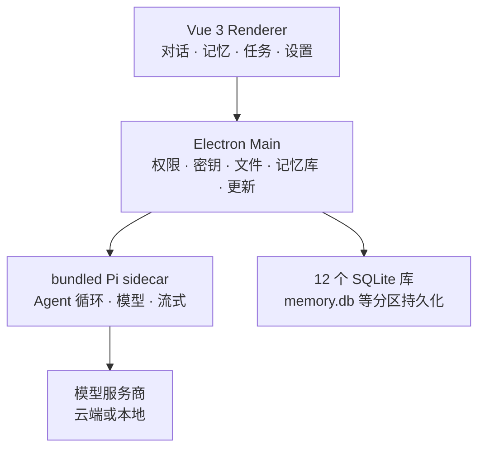

<p align="center">
  <a href="./README.md"><b>简体中文</b></a> ·
  <a href="./README.en.md">English</a>
</p>

<p align="center">
  
</p>

### 带长期记忆的本地优先 AI 办公助手。

**模型自己选。工作文件夹就在本机。助手会干活——你始终能看见它记住了什么、这一轮用了哪几条。**

本地优先 · 记忆可治理 · 模型自由 · Windows / macOS / Linux

[](https://github.com/onehopeA10/pibuddy/actions/workflows/ci.yml)
[](https://github.com/onehopeA10/pibuddy/releases)
[](https://github.com/onehopeA10/pibuddy/stargazers)

**[从源码运行](#从安装到第一句对话)** ·
[GitHub 预览版（未签名，手动安装）](https://github.com/onehopeA10/pibuddy/releases) ·
[产品文档](pibuddy-docs/README.md) ·
[架构](pibuddy-docs/docs/architecture/index.md) ·
[English](README.en.md)

**不绑 PiBuddy 账号。不强制中转。不默认把整段对话写进长期记忆。**

会话、记忆、任务和设置留在你的电脑里。模型请求直接发到你配置的服务商或本地接口。

> [!IMPORTANT]
> PiBuddy 仍在积极迭代，面向办公用户的桌面 Agent 产品线。默认界面是中文。已经可以承担真实对话、任务、记忆与办公工作流，接口与部分桌面行为还会继续演进。

---

## 不是又一个聊天框

很多助手要么塞在终端里，要么绑在某个编辑器，要么必须走云端账号。

**PiBuddy 给办公 Agent 一块自己的桌面：** 对话、任务、资源库、记忆、渠道、工作流、终端、模型与设置放在一起。开发者能力（终端、Git、worktree）在高级模式里，不挡日常办公。

Pi 负责把 Agent 跑起来。PiBuddy 负责让它在本机长期可用——尤其是**跨会话还记得该记得的事，并且这件事你说了算。**

### 记忆你说了算

这是我们和其他桌面 Agent 最不一样的地方。

长期记忆不是「把聊天记录再存一份」。它是一套**可治理**的记忆：

| 你能做的 | 实际承诺 |
| --- | --- |
| **显式保存** | 事实 / 偏好 / 指令 / 背景，按「本工作区」或「全局」落库 |
| **看见注入** | 相关对话会注入参考；面板列出「这一轮塞给模型的是哪几条」 |
| **确认再生效** | 从会话抽取的候选默认排除，你点过确认才进入注入 |
| **改、合、删** | 查看、编辑、合并、排除、删除、导出；删掉的条目不会再被检索或注入 |
| **知识库** | 带来源的文档与片段，检索时标出来源 |
| **语义检索** | 本地哈希嵌入即可近义查找；配了兼容端点再用服务商嵌入 |
| **密钥不进库** | 疑似密钥直接挡下；敏感路径默认不注入 |

记忆本体在本机 `memory.db`。关掉能力只收进程资源，**库里的条目一条不动**——卸载和删数据是两件事。

不默认把所有对话自动写入长期记忆。模型怎么知道你上次说过的，必须能在记忆页追到、改掉、删掉。

### 模型你自己选

OpenAI、Anthropic、OpenAI 兼容接口、本地网关，都可以接。会话不用重建，输入栏里就能换模型、思考力度和审批模式。

### 项目就在本地

打开本机工作文件夹。会话 JSONL、十二个按能力分区的 SQLite 库、密钥（系统安全存储）都在这台机器上。没有遥测上报。

### 助手能干活，但不是乱来

读文件、改文件、跑命令之前，工具调用走权限层。输入栏可选默认询问、接受编辑、少问或放行。Plan 模式先看方案再动手。

---

## 一块桌面，几件正经事

同一个助手，覆盖办公日常，而不是只改代码。

| | **对话** | **记忆** | **任务 / 工作流** |
| --- | --- | --- | --- |
| **你确认什么** | 这一轮要不要它动手 | 哪条事实可以长期留下 | 何时跑、跑到什么程度 |
| **助手做什么** | 读资料、改文件、出产物 | 在相关轮次注入已确认的记忆 | 定时或按图执行，会话可后台挂着 |
| **适合** | 写、查、改、总结 | 跨天、跨会话还认得你 | 重复劳动、长任务 |

对话在跑时可以排队下一条。窗口开一整天没说话，前台进程会休眠；你回到窗口或再发一句，它自己醒来，不必为了「开太久」重启应用。

---

## Local-first，但不玩文字游戏

PiBuddy 是 **本地优先**。本地优先不等于永远不联网。

| 数据 | 行为 |
| --- | --- |
| 会话 | 本机 JSONL，SQLite 建索引 |
| 长期记忆 / 知识库 | 本机 `memory.db`（FTS + 向量），删除覆盖正文、索引与注入缓存 |
| 任务、工作流、产物、用量…… | 其余能力库同样在本机，分区、可备份 |
| 设置 | 本机 |
| API 密钥 | 操作系统安全存储 / 主进程保险柜；界面只见「已配置 / 尾四位」 |
| 日志 | 本机，脱敏 |
| PiBuddy 遥测 | 无 |
| 模型请求 | 直接发到你配置的服务商或本地接口 |

没有必选的 PiBuddy 账号，也没有强制云端中转。用远程模型时，那一轮所需的上下文会按该服务商自己的隐私政策离开本机。

---

## 从安装到第一句对话

1. **准备环境**：Node.js `>=22`，pnpm `>=10`。
2. **拉代码并启动**

```bash
git clone https://github.com/onehopeA10/pibuddy.git
cd pibuddy
pnpm install
pnpm dev
```

3. **接一个模型**：打开 **模型** 或设置，选官方服务商或兼容接口，填入凭据（只进本机保险柜）。
4. **打开工作文件夹**，在输入栏说话。需要长期留下的事实，到 **记忆** 页显式保存，或从会话抽取后逐条确认。
5. **看注入命中**：下一轮相关问题时，打开记忆页核对「这一轮塞了什么」；不对就改或删。

发布前全量回归：

```bash
pnpm typecheck
pnpm test
pnpm test:regression
```

打包与签名见 [docs/product/RELEASE_SETUP.md](docs/product/RELEASE_SETUP.md)。

---

## 架构

界面、桌面高权限能力和 Agent 循环分开。渲染进程没有 Node integration。



| 层 | 职责 |
| --- | --- |
| Renderer | 只做呈现，按会话归一状态 |
| Preload | `contextIsolation` 下的窄接口，可验证、可撤销 |
| Main | 进程监督、权限、密钥、文件、Git、终端、记忆注入、备份 |
| pi sidecar | JSONL over stdio；默认同包 Pi，可换 |
| SQLite | 按能力域分区，逐库一致、可备份；库之间没有外键 |

**[阅读架构说明 →](pibuddy-docs/docs/architecture/index.md)**

---

## 建立在 pi 之上

PiBuddy 构建在 [pi-mono](https://github.com/badlogic/pi-mono) 的 Agent 运行时之上。

> **Pi 负责让 Agent 跑起来。PiBuddy 负责让它在办公桌面上长期可用——记得该记的，删得掉不该留的。**

技术栈：Electron、Vue 3、Pinia、Naive UI、TypeScript、electron-vite、node:sqlite。

---

## 当前状态

默认产品界面面向非开发者：聊天、文件与产物、历史、任务、记忆、设置。

已经具备的能力包括：bundled Pi 与运行时监管、多服务商模型、权限与审批模式、会话与草稿、长期记忆（显式保存 / 抽取确认 / 注入命中 / 知识库 / 语义检索）、定时任务、工作流、渠道连接器、终端、用量、本机备份与恢复、空闲休眠与聚焦唤醒。

主平台是 Windows 11 x64；macOS 与 Ubuntu 为次要平台。远程能力默认关闭。没有遥测。

---

## 文档

独立文档站在 [`pibuddy-docs/`](pibuddy-docs/README.md)（中文默认，英文在 `/en/`）：

```bash
cd pibuddy-docs
pnpm install
pnpm dev
```

- [产品范围与里程碑](pibuddy-docs/docs/guide/product-scope.md)
- [架构](pibuddy-docs/docs/architecture/index.md)
- [安全](pibuddy-docs/docs/security/index.md)
- [数据与备份](pibuddy-docs/docs/data/index.md)
- [发布](docs/product/RELEASE_SETUP.md)

英文 README：[README.en.md](README.en.md)。英文文档站入口：[pibuddy-docs/docs/en/](pibuddy-docs/docs/en/)。

---

## 参与

欢迎 Issue、缺陷、产品建议、文档和代码。大改动建议先开 Issue，对齐边界（尤其是记忆：默认不自动落长期库、删除必须覆盖注入）。

---

### 记住该记的。删掉不该留的。模型只是零件。

**[从源码运行](#从安装到第一句对话)** · [English](README.en.md)
